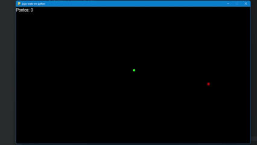

# Jogo snake
Fiz esse código para o projeto final do meu curso de python.
Onde em uma breve descrição ele é um jogo simples mas interessante pois em sua maioria é utilizado para o aprendizado das principais bibliotecas, funções e estruturas utilizadas na linguagem de python.
Muito divertido de jogar com atualização de ponstos na tela e se a cobrinha bater no próprio corpo ou nas paredes o jogo se encerra, deixando um jogo simples mais divertido, difícil e desafiador.
## 📸 Demonstração

